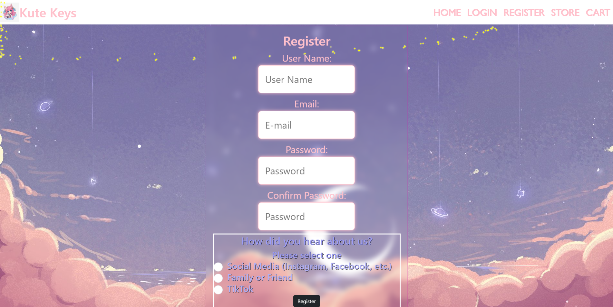
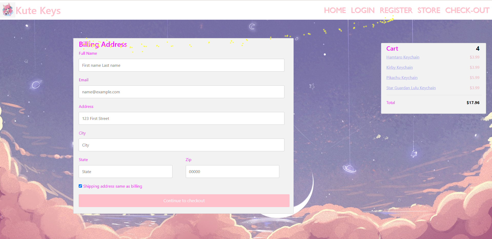

# Capstone1

##Home Page 
One interesting think I did on this page was add a bootstrap carousel. 

##Log-In Page
An interesting thing on this page was the added backdrop filter. I made it transparent while also have a blur behind it. 

##Register Page
As I did with the Log in page I added a backdrop filter. I made it transparent while also have a blur behind it.

##Store Page 
On the Store page I did not do anything "interesting" but I did spend quite a bit of time formating. 

##Check-Out Page. 
Using bootstrap and and css i was able to position the containers a certian way. 
