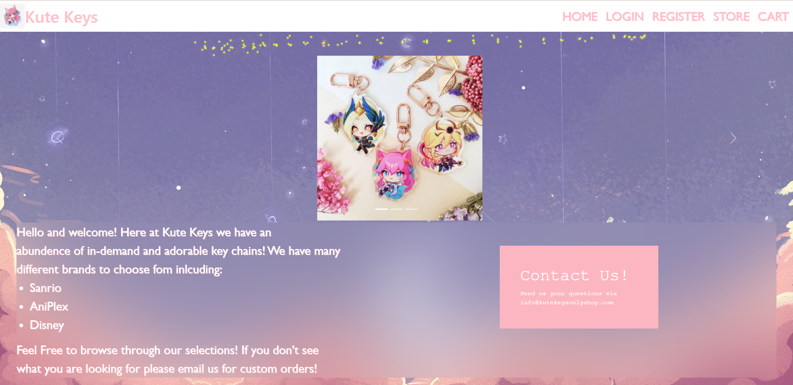
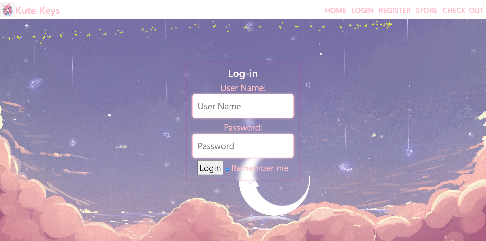
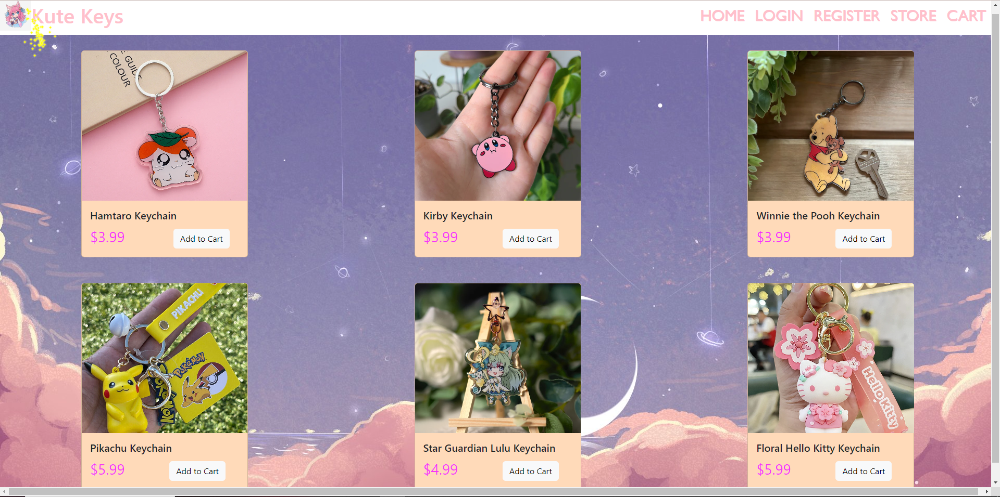

# Capstone1

##Home Page
This homepage is just giving a litte introduction on what we sell and how customers are able to contact us. 
One interesting think I did on this page was add a bootstrap carousel. 

##Log-In Page
This page allows people to log in to their existing account. 
An interesting thing on this page was the added backdrop filter. I made it transparent while also have a blur behind it. 

##Register Page
This page allows users to sign up for an account. 
As I did with the Log in page I added a backdrop filter. I made it transparent while also have a blur behind it.

##Store Page
This page showcases some of the items the store sells. 
On the Store page I did not do anything "interestin" but I did spend quite a bit of time formating. 

#Cart Page
This page shows users what they have added to their cart to purchase. 
I did some basic css here. Making someone of the bordereds dotted with a different color. 
